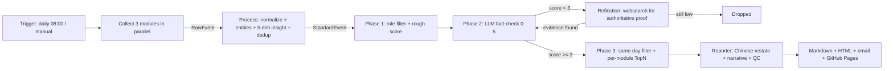

<div align="center">

# AI Insight Agent

**An autonomous market-intelligence agent that reads the AI industry for you every day.**

It crawls open-source momentum, cutting-edge papers, and company moves from dozens of live sources — then verifies, ranks, and distills them into a concise, readable daily briefing (Markdown + HTML + email), fully automatically.

[Live Daily Report](https://xtyAIdev.github.io/ai-insight-news/) · [中文版](README_CN.md) · [GitHub](https://github.com/xtyAIdev/ai-insight-news)


</div>

---

## What is this?

Every morning, an AI industry professional needs to answer three questions in five minutes:

1. **What is moving in open source right now?** — new repos, rising stars, hot communities
2. **What research actually matters today?** — papers from top institutions on LLM / agent / RAG / RL / multimodal
3. **What are the key companies doing?** — product launches, strategy shifts, funding rounds

AI Insight Agent answers all three. It is a fully autonomous **market-intelligence agent** (not a script that scrapes one feed) that runs a complete pipeline: multi-source collection → normalization → deduplication → fact-checking → quality scoring → ranking → report generation → delivery. It runs once a day, and it runs even without an LLM API key — a built-in rule engine keeps the whole pipeline alive offline.

> The daily report is generated every day by GitHub Actions and published to GitHub Pages — you can read it at [xtyAIdev.github.io/ai-insight-news](https://xtyAIdev.github.io/ai-insight-news).

---

## Why it exists

- **The problem:** AI moves too fast for manual tracking. RSS folders overflow, Twitter/X timelines are noisy, arXiv dumps hundreds of papers a day, and "what actually matters" gets buried.
- **The gap:** Most news aggregators just re-publish. They don't verify, rank, or explain *why* something matters.
- **The answer:** An agent that treats each event like an analyst would — check if it's real, score how important it is for *this* audience, keep only the top few per domain, and write each one up as a readable briefing (English-first, Chinese available), with source links for every claim.

---

## Features

### 🧭 Three domains, one daily briefing
| Domain | What it tracks | Primary sources |
|---|---|---|
| **Open Source** | LLM / Agent / RAG / MCP / AI Infra / open-weight models | GitHub Search API, ModelScope, Hugging Face, Gitee |
| **Papers** | LLM, reasoning, RAG, RL, multimodal, agents | arXiv (primary), OpenAlex (same-day), Hugging Face daily papers |
| **Enterprise** | Product launches, strategy, funding rounds | OpenAI/Anthropic/Google RSS + DeepSeek/Kimi blogs + TechCrunch/36Kr + aihot |

### ✅ Fact-checking before publishing
Every candidate event passes a **two-stage credibility check**:
1. **Rule engine** scores source credibility (S/A/B/C/D source-level table, multi-source cross-validation, missing-date penalty).
2. **LLM judge** re-scores authenticity (0–5). Low-scoring events trigger **Reflection** — a web search for authoritative corroboration, and if found, the event is upgraded with new evidence; otherwise it's re-judged or dropped. No date, no default-to-today: undated events are rejected, never invented.

### 🎯 Ranked, not dumped
Events are scored with **domain-specific importance rubrics** (community momentum for open source, institutional influence for papers, market impact for enterprises) and only the **TopN per module** (default 5) make it into the report — with a one-line *reason* for every pick.

### 🧠 Five-dimensional insight + quick comment
Each event gets a structured insight (what / why / trend / impact / action) used for ranking, and a human-style **quick comment** in the briefing so readers get the takeaway, not just the headline.

### 🌏 Bilingual briefing, English-first
TopN events are **restated into Chinese** by the LLM (analytical headline + body + comment) and kept alongside the original English. The report renders **in English by default** with an **En / 中文** toggle in the top-right corner. Both languages are generated per item, original titles and sources stay intact, and a rule-based fallback keeps Chinese output readable even when the LLM flakes.

### 🔌 Runs with or without an LLM key
Configure `LLM_API_KEY` (OpenAI-compatible) and every stage uses a real LLM. Without a key, the built-in **rule engine** drives the entire pipeline — entity extraction, insights, credibility, scoring, even report drafting all have deterministic rule implementations. Zero runtime dependencies; only TypeScript is a dev dependency.

### 🛟 Three-layer resilience
Live sources fail → **WebSearch fallback** (Hacker News / DuckDuckGo / Google News, key-free) → **local cache** (last successful snapshot, marked "stale"). Source health is tracked per source, and failing modules degrade gracefully instead of aborting the run.

### 🗄️ Full auditability
SQLite (built-in `node:sqlite`, WAL mode) stores every layer: raw events → standard events → high-quality events → reports, plus the enterprise watchlist pool, human feedback, task runs, and source health. Every event carries a **trace log** — which tool scored it, what stage it passed, and why.

### 📬 Delivery & feedback loop
Reports are archived as Markdown + HTML, optionally emailed via a built-in zero-dependency SMTP client, and published to GitHub Pages by Actions. A feedback endpoint records human scores vs. agent scores and computes weekly/monthly quality metrics (consistency rate, satisfaction rate, low-score reasons).

---

## Architecture

```
┌───────────────────────────────────────────────────────────────────────┐
│                        Scheduler (daily 08:00 / manual)                │
└──────────────────────────────┬────────────────────────────────────────┘
                               ▼
┌───────────────────────────────────────────────────────────────────────┐
│  Collectors — 3 modules in parallel (Promise.all)                      │
│                                                                        │
│  Open Source        Papers                 Enterprise                  │
│  GitHub Search ────► arXiv (primary) ─────► Branch A: company moves   │
│  ModelScope          OpenAlex (same-day)     official RSS/HTML →       │
│  Hugging Face        HF daily papers         media RSS → WebSearch     │
│  Gitee               WebSearch fallback   ┌─ Branch B: funding rounds  │
│  WebSearch fallback                        │   aihot → WebSearch        │
│                                            └─ enterprise pool (9 cos)  │
└──────────────────────────────┬────────────────────────────────────────┘
                               ▼
┌───────────────────────────────────────────────────────────────────────┐
│  Processor — normalize → entity extraction → classify → 5-dim insight │
│  → cross-source dedup (dual channel) → StandardEvent    (8 concurrent)│
└──────────────────────────────┬────────────────────────────────────────┘
                               ▼
┌───────────────────────────────────────────────────────────────────────┐
│  Evaluator — Phase 1: rule filter & rough score                        │
│              Phase 2: LLM fact-check (TopN×2 candidates)              │
│                       → Reflection (websearch corroboration if <3)    │
│              Phase 3: strict same-day filter → per-module TopN + rank │
└──────────────────────────────┬────────────────────────────────────────┘
                               ▼
┌───────────────────────────────────────────────────────────────────────┐
│  Reporter — Chinese restate → narrative (summary/future/watchlist)     │
│  → QC checklist & auto-fix → Markdown + HTML → archive → email push    │
└──────────────────────────────┬────────────────────────────────────────┘
                               ▼
                  SQLite (raw → standard → HQ events,
                  reports, pool, feedback, runs, source health)
                  + JSON cache layer (stale fallback)
```

### Agent workflow



---

## Tech stack

| Layer | Choice | Why |
|---|---|---|
| Language | **TypeScript** (strict, ESM) | Type safety across the whole pipeline |
| Runtime | **Node.js ≥ 22.13** | Built-in `node:sqlite` + `fetch` — no native deps |
| Storage | **SQLite (WAL)** | Zero-ops embedded DB for events, reports, feedback |
| LLM | **OpenAI-compatible API** (DeepSeek/OpenAI/…), `temperature` 0.1 scoring / 0.3 generation | Drop-in provider, configurable via `.env` |
| Fallback | **Built-in rule engine** | Deterministic implementations for every LLM stage |
| Scheduling | `node:cron`-style internal scheduler + **GitHub Actions** daily | Cron at home, Actions in CI |
| Delivery | Markdown + self-contained HTML + zero-dep SMTP + **GitHub Pages** | Reader-friendly everywhere |
| Deps | **0 runtime dependencies** (`typescript` dev-only) | Auditable, portable, tiny |

---

## Project structure

```
src/
├── cli/            # CLI: run / serve / site / db:init / feedback / metrics / list:*
├── config/         # .env loading + defaults; keyword libs, source tables, thresholds
├── types/          # Unified event schema (Raw / Standard / Report / Feedback)
├── db/             # SQLite layer: schema + repositories + source health
├── utils/          # http (retry/timeout), websearch, cache, normalize, trace, logger
├── llm/            # Provider (OpenAI-compatible) + rule engine fallback
├── collectors/     # opensource.ts / paper.ts / enterprise.ts (dual-branch)
├── processor/      # Standardize → entities → classify → insight → dedup (8× concurrency)
├── evaluator/      # Rule filter → LLM fact-check → Reflection → per-module TopN
├── reporter/       # Chinese restate → narrative → QC → Markdown/HTML → email → feedback
└── orchestrator/   # Pipeline (parallel modules, global/module timeouts) + scheduler
```

---

## Quick start

**Requirements:** Node.js ≥ 22.13 (no database, no native modules)

```bash
git clone https://github.com/xtyAIdev/ai-insight-news.git
cd ai-insight-news

npm install                # installs only typescript (compile-time)
cp .env.example .env       # optional: set LLM_API_KEY to enable real LLM

npm run                    # compile + run one full daily-report pipeline
npm run serve              # local web viewer at http://localhost:8787
npm run site               # public-style site at http://localhost:8899 (today + archive)
```

**Runs with zero configuration.** Without `LLM_API_KEY` the pipeline degrades to the built-in rule engine and still produces a complete report. Set the key and every stage (entity extraction, insights, fact-checking, scoring, Chinese restating, narrative) uses a real LLM.

### CLI

```bash
npm run -- run                          # full pipeline for today
npm run -- run --date 2026-08-20        # backfill a specific date
npm run -- run --modules opensource,paper   # run only some modules
npm run -- feedback --event <id> --score 4 --tags low-quality   # record human feedback
npm run -- metrics --period weekly      # quality metrics from feedback
```

### Environment variables

| Variable | Default | Description |
|---|---|---|
| `LLM_API_KEY` | *(empty)* | OpenAI-compatible key; empty → rule-engine mode |
| `LLM_BASE_URL` | `https://api.deepseek.com/v1` | API endpoint |
| `LLM_MODEL` | `deepseek-chat` | Model name |
| `SCHEDULE_TIME` | `08:00` | Daily auto-run time |
| `GLOBAL_TIMEOUT_MIN` | `30` | Hard timeout for the whole pipeline |
| `MODULE_TIMEOUT_MIN` | `20` | Per-module collection timeout |
| `TIME_WINDOW_HOURS` | `24` | Collection window; auto-expands on empty results |
| `TOP_N` | `5` | Events per module in the report |
| `MAIL_*` | off | Optional email push (zero-dep SMTP) |

> **GitHub Actions:** the repo ships `.github/workflows/daily-report.yml` — daily at UTC 00:00 (Beijing 08:00) it runs the full pipeline and deploys a static site to Pages. Add only `LLM_API_KEY` to **Settings → Secrets and variables → Actions** to enable the real LLM in CI (optional). Failed runs open a ⚠️ issue automatically.

---

## Example output

> A daily report generated automatically from live data — [read the real thing](https://xtyAIdev.github.io/ai-insight-news/).
>
> Reports are **bilingual**: English by default (Markdown + HTML web view), with a one-click switch to Chinese in the HTML view (`.zh.md` archived alongside). Each item shows the real date, entity, tags, a human-style quick comment, and clickable source links — no claim without a source, no date invented.

````markdown
# AI Industry Market Intelligence Daily
> Date：2026-08-27 ｜ Report ID：report_20260827

## 📌 Today at a Glance
Today's AI landscape highlights three major trends: the open-source stack
continues to thrive with dify, RAGFlow, unsloth, pydantic-ai advancing agent
workflows and RAG; academic research focuses on multimodal retrieval and
multi-agent orchestration; on the corporate front, ByteDance launched
QueryStory to enhance AI trustworthiness, Meta agreed to sweeping child-safety
restrictions, and Amazon tripled its Nvidia chip orders.

## AI Open Source
### 1. dify：Build Agentic workflows, RAG pipelines, with rich AI model
Build Agentic workflows, RAG pipelines, with rich AI model and tool support…
**Time**：2026-08-27
**Entity**：langgenius ｜ ⭐ 153,612 ｜ **Tags**：agent / rag / workflow
**Why picked**：Dify leads AI app dev frameworks with 153.6k stars and 24k forks…
**Source**：[GitHub](https://github.com/langgenius/dify)
---
## AI 学术研究 / AI 企业动态（略）
## 🔭 Future watch / 👀 Watchlist
````

Toggle **En / 中文** in the top-right corner of any report page to switch languages.

---

## License

MIT
