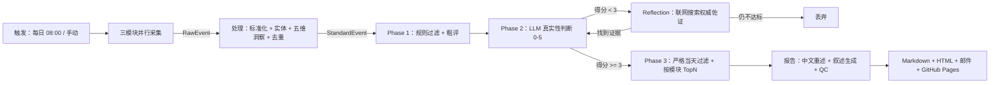

<div align="center">

# AI Insight Agent

**一个每天替你读懂 AI 行业的市场情报 Agent。**

它从几十个实时源自动采集开源动态、前沿论文与企业动态，经过核验、评分、排序，沉淀为一份简洁可读的每日简报（Markdown + HTML + 邮件），全程无人值守。

[在线日报](https://xtyAIdev.github.io/ai-insight-news/) · [English](README.md) · [GitHub](https://github.com/xtyAIdev/ai-insight-news)


</div>

---

## 这是什么？

做 AI 行业的人，每天早晨都要在五分钟内回答三个问题：

1. **开源世界今天在发生什么？** —— 新项目、新趋势、热度攀升的社区
2. **今天真正值得读的论文是哪几篇？** —— 头部机构在大模型 / Agent / RAG / 强化学习 / 多模态上的进展
3. **头部公司在做什么？** —— 产品发布、战略调整、融资并购

AI Insight Agent 一次回答三个问题。它不是"抓一个源就完事"的爬虫脚本，而是一个完整的 **市场情报 Agent**：多源采集 → 标准化 → 去重 → 真实性核验 → 质量评分 → 排序 → 报告生成 → 推送，全链路自动执行。每天跑一次，**即使没有配置 LLM Key 也能跑**——内置规则引擎保证全流程离线可用。

> 项目已接入 GitHub Actions 每日自动运行，并发布到 GitHub Pages：**https://xtyAIdev.github.io/ai-insight-news**（含历史归档，每天更新）。

---

## 为什么做这个？

- **痛点：** AI 行业变化太快，手动跟踪根本追不上。RSS 订阅爆满、社交媒体噪声大、arXiv 每天几百篇论文，真正重要的信息被淹没。
- **缺口：** 大多数资讯聚合器只是"转发"，不核验、不排序、不解释**为什么重要**。
- **答案：** 一个像分析师一样对待每一条事件的 Agent——先判断真伪，再评估对目标读者有多重要，每个领域只保留 TopN，然后用人类真正读得下去的语言（中文）写出来，每条都附可点击的来源链接。

---

## 核心能力

### 🧭 三大领域，一份日报
| 领域 | 追踪什么 | 主要数据源 |
|---|---|---|
| **AI 开源** | LLM / Agent / RAG / MCP / AI Infra / 开源模型 | GitHub Search API、ModelScope、Hugging Face、Gitee |
| **AI 论文** | 大模型 / 推理 / RAG / 强化学习 / 多模态 / Agent | arXiv（主源）、OpenAlex（当天补充）、HF daily papers |
| **AI 企业** | 产品发布、战略动态、投融资 | OpenAI/Anthropic/Google 官方 RSS + DeepSeek/Kimi 官方博客 + TechCrunch/36氪 + aihot |

### ✅ 发布前先核验
每条候选事件都要过**两阶段真实性检查**：
1. **规则引擎**按信源等级表（S/A/B/C/D）打分，多源交叉验证加分，日期缺失扣分。
2. **LLM 审核员**二次判定真实性（0-5 分）。低分事件触发 **Reflection 补证**——自动联网搜索权威佐证，找到则追加证据重新计分；找不到再交由 LLM 重判，仍不达标才丢弃。**日期必须真实**：未知日期一律拒绝，绝不默认"今天"。

### 🎯 排序而非倾倒
事件按**领域差异化评分标准**打分（开源看社区热度、论文看机构影响力、企业看市场影响），每模块只保留 **TopN**（默认 5 条）进日报，且每条都附一句**入选理由**。

### 🧠 五维洞察 + 快评
每条事件生成结构化洞察（是什么 / 为什么 / 趋势 / 影响 / 建议）用于排序，日报里再配一句人类口吻的**快评**——读者拿到的是结论，不只是标题。

### 🌏 中文日报，英文溯源
TopN 事件由 LLM **重述为中文**（分析式标题 + 正文 + 快评），英文原标题保留在描述末尾便于核对；LLM 偶发抽风时，规则级兜底仍能产出可读中文。

### 🔌 有 Key 无 Key 都能跑
配置 `LLM_API_KEY`（OpenAI 兼容协议）后，实体抽取、洞察、核验、评分、重述、叙述全部走真实 LLM。不配 Key 时**内置规则引擎**接管全部环节——每个 LLM 环节都有确定性的规则实现。零运行时依赖，仅 TypeScript 一个编译期依赖。

### 🛟 三层兜底
实时源失败 → **WebSearch 兜底**（Hacker News / DuckDuckGo，免 Key）→ **本地缓存**（最近一次成功快照，标注"缓存数据"）。每个源都有健康状态追踪，模块降级不影响整体运行。

### 🗄️ 全链路可审计
SQLite（Node 内置 `node:sqlite`，WAL 模式）分层存储：原始事件 → 标准化事件 → 高质量事件 → 报告，外加企业池、人工反馈、任务记录、源健康状态。每条事件带 **trace_log 全链路日志**——哪个工具打的分、过了哪些阶段、为什么这么判，一目了然。

### 📬 推送与反馈闭环
日报归档为 Markdown + HTML 双格式，可选邮件推送（内置零依赖 SMTP），Actions 自动发布到 GitHub Pages。反馈接口记录人工评分与 Agent 评分的差异，输出周/月质量指标（评分一致率、满意度、低分原因分布）。

---

## 架构

```
┌───────────────────────────────────────────────────────────────────────┐
│                        调度器（每日 08:00 / 手动触发）                    │
└──────────────────────────────┬────────────────────────────────────────┘
                               ▼
┌───────────────────────────────────────────────────────────────────────┐
│  采集层 —— 三大模块并行（Promise.all）                                    │
│                                                                        │
│  开源技术            论文                   企业动态                      │
│  GitHub Search ───► arXiv（主源）───────► 分支A：企业动态                │
│  ModelScope         OpenAlex（当天补充）    官方 RSS/HTML → 媒体 RSS     │
│  Hugging Face       HF daily papers        → WebSearch 兜底             │
│  Gitee              WebSearch 兜底      ┌─ 分支B：投融资                 │
│  WebSearch 兜底                          │   aihot → WebSearch           │
│                                          └─ 企业池（9 家，每家≤2条）      │
└──────────────────────────────┬────────────────────────────────────────┘
                               ▼
┌───────────────────────────────────────────────────────────────────────┐
│  处理层 —— 标准化 → 实体抽取 → 分类校验 → 五维洞察                          │
│  → 跨源去重（双通道）→ StandardEvent          （8 并发）                   │
└──────────────────────────────┬────────────────────────────────────────┘
                               ▼
┌───────────────────────────────────────────────────────────────────────┐
│  评估层 —— Phase 1：规则过滤 + 粗评                                       │
│              Phase 2：LLM 真实性判断（TopN×2 候选）                      │
│                       → Reflection 联网补证（低分触发）                   │
│              Phase 3：严格当天过滤 → 按模块 TopN + 入选理由                │
└──────────────────────────────┬────────────────────────────────────────┘
                               ▼
┌───────────────────────────────────────────────────────────────────────┐
│  报告层 —— 中文重述 → 叙述生成（速览/展望/观察名单）                        │
│  → QC 质量检查 & 自动修复 → Markdown + HTML → 归档 → 邮件推送              │
└──────────────────────────────┬────────────────────────────────────────┘
                               ▼
              SQLite（原始 → 标准化 → 高质量事件、报告、企业池、
              反馈、任务记录、源健康）+ JSON 缓存层（stale 兜底）
```

### Agent 工作流



---

## 技术栈

| 层面 | 选型 | 理由 |
|---|---|---|
| 语言 | **TypeScript**（严格模式，ESM） | 全链路类型安全 |
| 运行时 | **Node.js ≥ 22.13** | 内置 `node:sqlite` + `fetch`，零原生依赖 |
| 存储 | **SQLite（WAL）** | 免运维嵌入式数据库，承载事件/报告/反馈 |
| LLM | **OpenAI 兼容 API**（DeepSeek/OpenAI 等），评分 0.1 / 生成 0.3 | 可插拔 Provider，`.env` 一键切换 |
| 降级 | **内置规则引擎** | 每个 LLM 环节都有确定性规则实现 |
| 调度 | 内部调度器 + **GitHub Actions** 每日执行 | 本地可跑，CI 自动跑 |
| 交付 | Markdown + 自包含 HTML + 零依赖 SMTP + **GitHub Pages** | 随处可读 |
| 依赖 | **0 个运行时依赖**（typescript 仅编译期） | 可审计、可移植、体积小 |

---

## 目录结构

```
src/
├── cli/            # CLI：run / serve / site / db:init / feedback / metrics / list:*
├── config/         # .env 加载 + 默认值；关键词库、信源等级表、过滤阈值
├── types/          # 统一事件 Schema（原始 / 标准化 / 报告 / 反馈）
├── db/             # SQLite 数据层：建表 + 仓储 + 源健康
├── utils/          # http（重试/超时）、websearch、缓存、归一化、trace、日志
├── llm/            # Provider（OpenAI 兼容）+ 规则引擎降级
├── collectors/     # opensource.ts / paper.ts / enterprise.ts（双分支）
├── processor/      # 标准化 → 实体 → 分类 → 洞察 → 去重（8 并发）
├── evaluator/      # 规则过滤 → LLM 核验 → Reflection → 按模块 TopN
├── reporter/       # 中文重述 → 叙述 → QC → Markdown/HTML → 邮件 → 反馈
└── orchestrator/   # 编排（并行模块、全局/模块超时）+ 调度器
```

---

## 快速开始

**环境要求：** Node.js ≥ 22.13（无需数据库、无需原生模块）

```bash
git clone https://github.com/xtyAIdev/ai-insight-news.git
cd ai-insight-news

npm install                # 仅安装 typescript（编译期依赖）
cp .env.example .env       # 可选：填入 LLM_API_KEY 启用真实 LLM

npm run                    # 一键：编译 + 运行一次完整日报流程
npm run serve              # 本地 Web 查看器 http://localhost:8787
npm run site               # 公网站点样式预览 http://localhost:8899（今日日报 + 归档）
```

**零配置可跑。** 不配 `LLM_API_KEY` 时全流程自动降级为内置规则引擎，照样产出完整日报；配上 Key 后，实体抽取、洞察、核验、评分、中文重述、叙述生成全部走真实 LLM。

### 命令行

```bash
npm run -- run                          # 今日完整流程
npm run -- run --date 2026-08-20        # 回补指定日期
npm run -- run --modules opensource,paper   # 只跑部分模块
npm run -- feedback --event <id> --score 4 --tags 低质量   # 记录人工反馈
npm run -- metrics --period weekly      # 查看周质量指标
```

### 环境变量

| 变量 | 默认 | 说明 |
|---|---|---|
| `LLM_API_KEY` | 空 | OpenAI 兼容 Key；空则规则引擎降级 |
| `LLM_BASE_URL` | `https://api.deepseek.com/v1` | API 端点 |
| `LLM_MODEL` | `deepseek-chat` | 模型名 |
| `SCHEDULE_TIME` | `08:00` | 每日自动触发时间 |
| `GLOBAL_TIMEOUT_MIN` | `30` | 全流程硬超时（分钟） |
| `MODULE_TIMEOUT_MIN` | `20` | 单模块采集超时（分钟） |
| `TIME_WINDOW_HOURS` | `24` | 采集窗口；无结果自动扩展 |
| `TOP_N` | `5` | 每模块进日报的事件数 |
| `MAIL_*` | 关 | 可选邮件推送（零依赖 SMTP） |

> **GitHub Actions：** 仓库自带 `.github/workflows/daily-report.yml`——每天 UTC 00:00（北京时间 08:00）自动跑完整流程并部署静态站点到 Pages。只需在 **Settings → Secrets and variables → Actions** 添加 `LLM_API_KEY` 一个 Secret（可选）即可在 CI 启用真实 LLM。运行失败会自动创建 ⚠️ 告警 Issue，不会静默丢失。

---

## 输出示例

> 以下为真实采集数据自动生成的日报——[在线查看完整版](https://xtyAIdev.github.io/ai-insight-news/)。

````markdown
# AI 行业市场洞察日报
> 日期：2026-08-25 ｜ 报告编号：report_20260825

## 📌 今日要闻速览
今日AI行业动态显示，开源工具链持续完善，Ragas、Dify、unsloth和CopilotKit
等项目的更新显著降低了开发门槛……整体来看，AI技术正从模型性能竞赛转向
易用性与生态整合，开源与商业化并进成为关键趋势。

## AI 开源技术
### 1. Ragas更新：开源LLM/RAG评估框架集成LangChain与LlamaIndex
Ragas是一个开源的Python评估框架，专为LLM和RAG（检索增强生成）应用设计……
**时间**：2026-08-25
**主体**：api-evangelist ｜ **标签**：ai-evaluation / llm / metrics
**来源**：[GitHub](https://github.com/api-evangelist/ragas)
---
### 2. Dify更新：一站式Agent工作流与RAG管道，云/VPC/自托管灵活部署
……
## AI 学术研究 / AI 企业动态（略）
## 🔭 未来关注建议 / 👀 观察名单
````

每条日报都包含：**中文分析式标题**、一句**快评**、真实**时间**、**主体**、**标签**和可点击的**来源链接**。每条都有出处，日期绝不虚构。

---

## License

MIT
